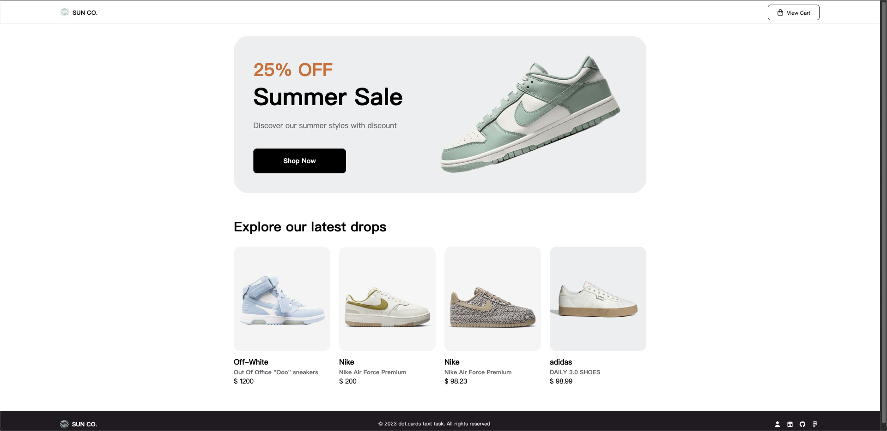
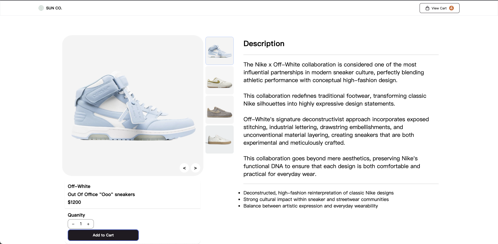
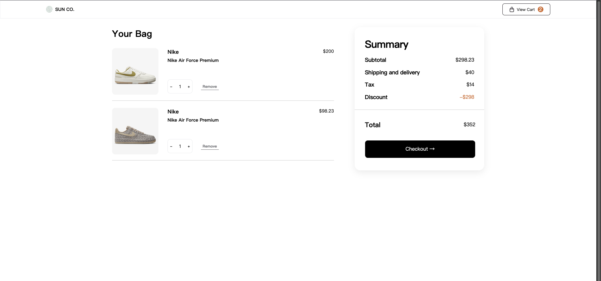

# 🛒 Shoe Store

這是一個使用 React + TypeScript 建立的購物網站，實作完整購物車邏輯（Cart System）。

---

## 專案預覽

首頁畫面


商品畫面


結帳畫面


## 🚀 Features

- 商品列表與商品頁
- 相同商品自動合併數量
- 購物車數量增減
- 加入購物車（Add to Cart）
- 移除商品
- 即時計算價格
  - Subtotal（小計）
  - Discount（折扣）
  - Tax（稅）
  - Final Price（總價）
- Navbar 顯示購物車數量
- User 下單讀資料集中在 CartContext，讓 Product、Bag、Navbar 共用同一份資料
- 商品資訊集中在 ProductContext，方便後續加入新資料

---

## 🏗 Tech Stack

- React
- TypeScript
- Context API
- CSS / SCSS
- Figma

---

## 📂 Project Structure

```　
src
├── Components
│ └──Footer.tsx
│ └──Header.tsx
│ └──Layout.tsx
├── Context
│ └──ProductContext.tsx
│ └── CartContext.tsx
├── Pages
│ └──Bag.tsx
│ └──Homepage.tsx
│ └──Page404.tsx
│ └──Product.tsx
├── Router
│ └── Rotuer.tsx

```

---

## 🛒 Cart Logic

### Add to Cart

- 若商品已存在 → quantity 累加
- 若不存在 → 新增商品

### Update Quantity

- 使用 map 更新指定 item
- 保持 immutable

---

## 💰 Pricing Flow

cart → subtotal → discount → tax → finalPrice

---

## 📦 Installation

```bash
git clone https://github.com/freddy990117/Shoe_Store.git

cd Shoe_Store

npm install
npm run dev
```

---

## 🔥 Future Improvements

- 💾 localStorage（重新整理後商品不消失）
- 🧾 Checkout Page
- ❤️ Wishlist
- 📱 Responsive Design

---

## 👨‍💻 Author

Freddy Chang
